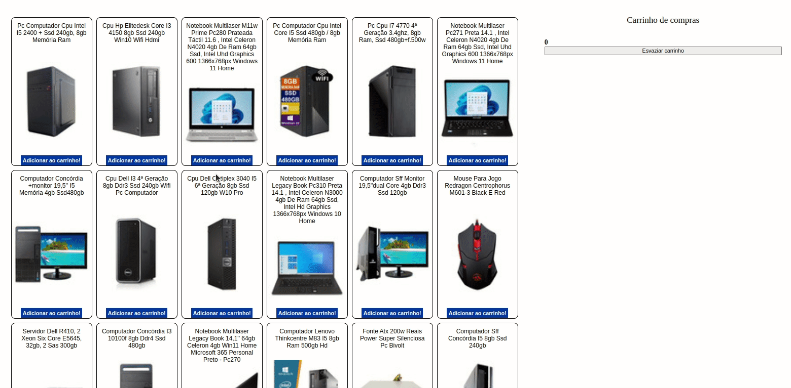

# Shopping Cart

Oitavo projeto desenvolvido no módulo de Fundamentos do Curso de Desenvolvimento Web da Trybe.

Template de uma aplicação e-commerce, simulando compras e adicionando em um carrinho de compras dinâmico.

O projeto consistia em exercitar as habilidades de utilização da função fetch para consumir dados de uma API do mercado livre e também foi trabalhado o conceito de JavaScript síncrono e assíncrono.

## 🚀 Tecnologia

- ⚡ JavaScript é uma linguagem de programação interpretada estruturada, de script em alto nível com tipagem dinâmica fraca e multiparadigma.

- ⚡ HTML é a linguagem base para se desenvolver qualquer site. 

- ⚡ CSS é uma linguagem de folha de estilo composta por “camadas”, criado com o propósito de estilizar as páginas HTML.

- ⚡ Jest é um framework de teste unitário de código aberto em JavaScript criado pelo Facebook a partir do framework Jasmine.

## ✋🏻 Pré-requisitos

- [git](https://git-scm.com/downloads): Ferramenta para gerenciar o código-fonte

- [Visual Studio Code](https://code.visualstudio.com/): Editor de Código Fonte

## :hammer_and_wrench: Antes de iniciar o projeto.

No diretório do projeto, instale as dependências e inicialize o projeto:

### `npm install`

Instala as dependências.
